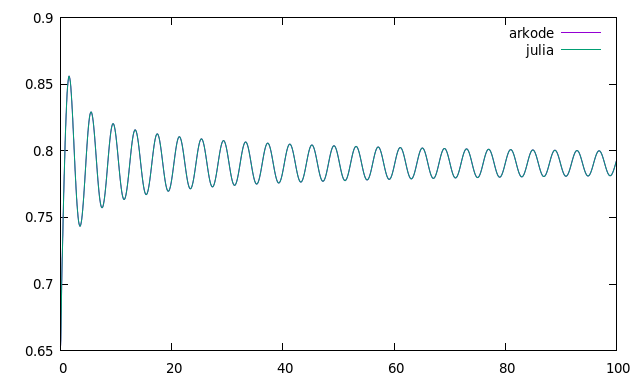

# swave quench dynamics

## Results
An implementation of the same program simulating the BCS s-wave quench dynamics
in both SUNDIALS ARKODE and Julia DifferentialEquations.jl. The performance of
the Julia version is significantly faster for the same algorithm. The
benchmarks for the ODE solve using the Dormand Prince algorithm in each swuite
(DP5() in Julia and DORMAND_PRINCE_7_4_5 in ARKODE). I ran each of them twice
in succession and took the lowest time:

Julia (1 core): 16.526554 seconds (17.12 M allocations: 814.778 MiB, 1.40% gc time)

ARKODE (4 cores openmp nvector): 55 seconds
