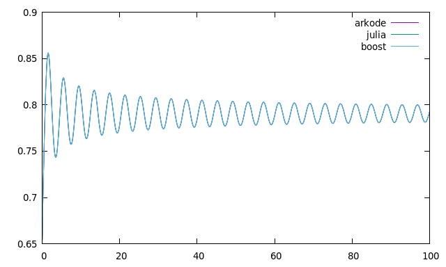

# swave quench dynamics

## Results
An implementation of the same program simulating the BCS s-wave quench dynamics
in different ODE solvers. The amount of time taken to complete for each solver is listed.
Each solver is using the Dormand Prince algorithm.

Julia DP5() (1 core): 16.526554 seconds (17.12 M allocations: 814.778 MiB, 1.40% gc time)

ARKODE DORMAND_PRINCE_7_4_5 (4 cores openmp nvector): 55 seconds

boost::numeric::odeint runge_kutta_dopri5 (1 core): 19.4312 seconds
boost::numeric::odeint runge_kutta_dopri5 (2 cores openmp): 10.7186 seconds
